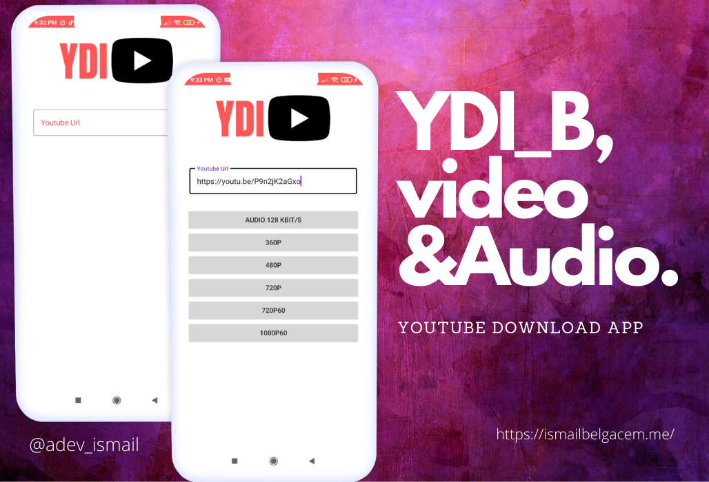

# YDI-B 

in this project will be Application   based YouTube url extractor .
downloader youtube video and audio from url

## Gradle

To always build from the latest commit with all updates. Add the JitPack repository:
```bash
repositories {
    maven { url "https://jitpack.io" }
}
````
And the dependency:
```bash
implementation 'com.github.HaarigerHarald:android-youtubeExtractor:master-SNAPSHOT'
````
## Screenshots

## Author

**Ismail BLegacm**

- [Profile](https://github.com/ismail998 "ismail belgacem")
- [Email](mailto:blegasemismail@gmail.com?subject=Hi "Hi!")
- [Website](https://ismailbelgacem.me/ "Welcome")

## 🤝 Support

Contributions, issues, and feature requests are welcome!

Give a ⭐️ if you like this project!
## Contributing
Pull requests are welcome. For major changes, please open an issue first to discuss what you would like to change.

Please make sure to update tests as appropriate.

## License
[MIT](https://choosealicense.com/licenses/mit/)
